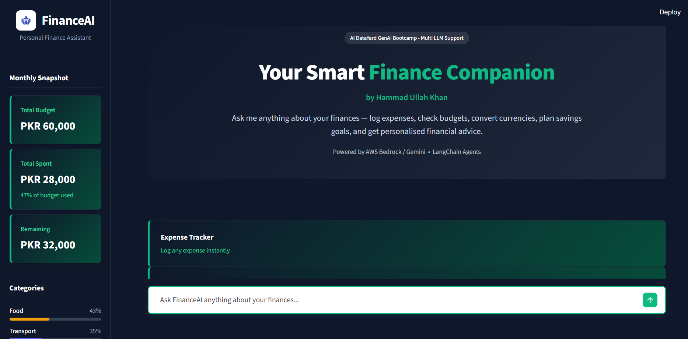
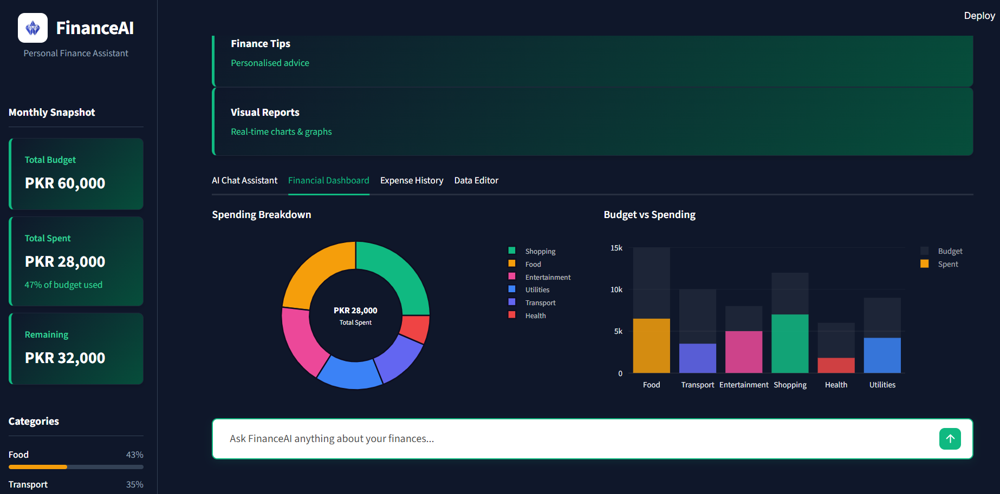
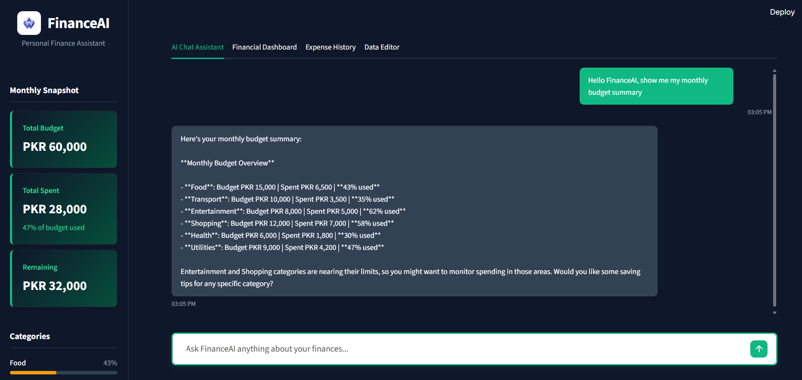

# FinanceAI - Personal Finance Assistant



## Improved AI-powered Personal Finance Assistant - AI DataYard GenAI Bootcamp

Built with **Google Gemini 1.5 Flash** / **AWS Bedrock** | **LangChain Agents** | **Streamlit** | **Plotly**

---

## What's Improved Over the Original

| Feature | Original | FinanceAI (This Project) |
|---|---|---|
| AI Model | AWS Bedrock (Nova Lite) | Google Gemini 1.5 Flash / AWS Bedrock |
| LangChain Tools | 5 tools | **8 tools** |
| Budget Categories | 4 | **6** (+ health, utilities) |
| Currencies | 4 | **8** (+ AED, SAR, CAD, AUD) |
| Charts | None | **Donut, Bar, Gauge (Plotly)** |
| Dashboard Tab | None | **Full financial dashboard** |
| Expense History | None | **Persistent session log** |
| KPI Stat Cards | None | **4 live KPI cards** |
| New Tools | None | **EMI Calculator, Spending Analysis** |
| Theme | Basic Streamlit | **Professional Light DataYard Theme** |
| Sidebar | Simple | **Live progress bars per category** |

---

## Interactive Dashboard



---

## Features

| Tool | Description |
|---|---|
| `log_expense` | Log an expense with amount, category & description |
| `get_budget_status` | Check budget for a single category |
| `get_all_budget_summary` | Full overview of all 6 categories |
| `convert_currency` | Convert between 8 currencies |
| `calculate_savings_goal` | Project time to reach a savings target |
| `get_financial_tips` | Personalised tips by topic |
| `analyze_spending_pattern` | Detect overspending across categories |
| `calculate_loan_emi` | Monthly EMI calculation with full breakdown |

---

## Intelligent Chat Assistant



---

## Setup & Installation

### 1. Clone / Download this project

```bash
git clone https://github.com/HammadKhan71/Finance-Agent.git
cd Finance-Agent
```

### 2. Install dependencies

```bash
pip install -r requirements.txt
```

### 3. API Key Setup

Set your API key using one of the methods below:

**Option - .env file (recommended)**
Create a `.env` file in the root folder and paste your key:
```env
GOOGLE_API_KEY="your_api_key_here"
AWS_BEARER_TOKEN_BEDROCK="your_aws_key_here"
```

### 4. Run the app

```bash
streamlit run app.py
```

---

## Example Queries

```text
I spent PKR 3,500 on groceries today
What is my entertainment budget remaining?
Convert 200 USD to AED
How long to save PKR 1,000,000 if I save PKR 20,000/month?
Calculate EMI for PKR 2,000,000 at 20% annual rate for 5 years
Analyse my spending patterns and give me advice
Give me investing tips
Show me all my budget categories
```

---

## Tech Stack

- **Python 3.10+**
- **Streamlit** - Web UI framework
- **LangChain** - Agent & tool orchestration
- **langchain-google-genai** - Gemini integration
- **Plotly** - Interactive financial charts
- **Pandas** - Data tables
- **python-dotenv** - Environment management

---

Built for AI DataYard Generative AI Bootcamp
